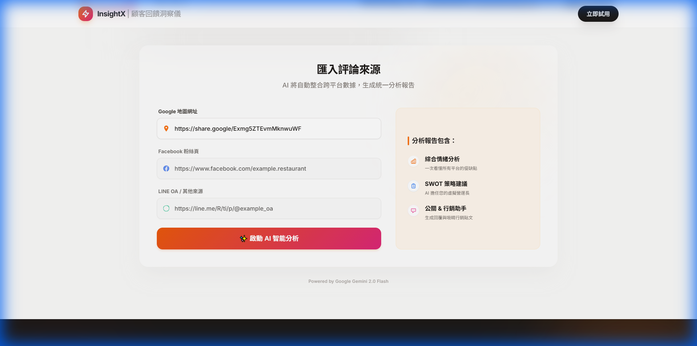

<div align="center">

# 🔍 InsightX

**AI-Powered Customer Feedback Intelligence Tool**

[](https://www.python.org/downloads/)
[](https://fastapi.tiangolo.com/)
[](https://reactjs.org/)
[](https://www.typescriptlang.org/)
[](LICENSE)

**Language / 語言:** 🇺🇸 English | [🇹🇼 繁體中文](README_zh-TW.md)

[🌟 Features](#-features) •
[📸 Screenshots](#-screenshots) •
[🚀 Quick Start](#-quick-start) •
[📖 Documentation](#-documentation)

</div>

---

## 📋 Table of Contents

- [Overview](#-overview)
- [Features](#-features)
- [Screenshots](#-screenshots)
- [Prerequisites](#-prerequisites)
- [Quick Start](#-quick-start)
  - [For End Users (Production)](#for-end-users-production)
  - [For Developers (Development)](#for-developers-development)
- [Project Structure](#-project-structure)
- [Environment Configuration](#-environment-configuration)
- [API Documentation](#-api-documentation)
- [Troubleshooting](#-troubleshooting)
- [Contributing](#-contributing)
- [License](#-license)

---

## 🎯 Overview

**InsightX** is an AI-powered customer feedback analysis platform that transforms scattered reviews from Google Maps, Facebook, and LINE into actionable business insights. Using Google Gemini 2.0, InsightX provides restaurant managers with:

- 📊 **Comprehensive Sentiment Analysis** across multiple platforms
- 🎯 **SWOT-based Strategic Recommendations**
- 💬 **AI-Generated Response Templates** for customer reviews
- 📝 **Automated Marketing Content** based on customer feedback
- 🎮 **Interactive Decision Simulation Game** to train management skills

---

## ✨ Features

### 🔥 Core Features

- **Multi-Platform Integration**: Automatically scrapes and analyzes reviews from:
  - 🗺️ Google Maps
  - 📘 Facebook Pages
  - 💚 LINE Official Accounts

- **AI-Powered Analysis**:
  - Sentiment classification (positive/negative/neutral)
  - Key pain points and highlights extraction
  - SWOT analysis generation
  - Actionable improvement suggestions

- **Manager Tools**:
  - One-click review response generation
  - Social media marketing content creation
  - Data-driven decision support

### 🎮 Bonus: Manager Decision Simulator

An interactive training game featuring:
- 10 real-world restaurant management scenarios
- Customer data vs. intuition comparisons
- Instant AI feedback on decisions
- Personalized improvement recommendations

---

## 📸 Screenshots

### Main Interface - AI Analysis Dashboard


*Landing page with clean, modern UI showcasing the AI-powered analysis engine*

---

### Input Interface - Multi-Platform Data Collection



*Simple URL input interface for Google Maps, Facebook, and LINE review sources*

---

### Manager Decision Simulator

<table>
  <tr>
    <td width="50%">
      
      <p align="center"><em>Start screen with engaging visual design</em></p>
    </td>
    <td width="50%">
      
      <p align="center"><em>Interactive scenario with real customer data</em></p>
    </td>
  </tr>
</table>

---

## 📦 Prerequisites

Before you begin, ensure you have the following installed:

| Tool                  | Version | Purpose                                      |
| --------------------- | ------- | -------------------------------------------- |
| **Python**            | 3.10+   | Backend runtime                              |
| **Node.js**           | 18+     | Frontend buildtools                          |
| **npm**               | 9+      | JavaScript package manager                   |
| **uv**                | Latest  | Python package & virtual environment manager |
| **Docker** (Optional) | Latest  | Containerized deployment                     |

### Installing UV

```bash
# Windows (PowerShell)
powershell -ExecutionPolicy ByPass -c "irm https://astral.sh/uv/install.ps1 | iex"

# macOS/Linux
curl -LsSf https://astral.sh/uv/install.sh | sh
```

---

## 🚀 Quick Start

### For End Users (Production)

#### Option 1: Docker Compose (Recommended)

The fastest way to get InsightX running:

```bash
# 1. Clone the repository
git clone https://github.com/yourusername/InsightX.git
cd InsightX

# 2. Configure environment variables
cp .env.example .env
# Edit .env and add your GEMINI_API_KEY

# 3. Start the application
docker compose up -d

# 4. Open your browser
# Navigate to http://localhost:8000
```

That's it! 🎉 The application is now running.

To stop:
```bash
docker compose down
```

---

#### Option 2: Manual Build & Run

If you prefer not to use Docker:

```bash
# 1. Clone the repository
git clone https://github.com/yourusername/InsightX.git
cd InsightX

# 2. Configure environment variables
cp .env.example .env
# Edit .env and add your GEMINI_API_KEY

# 3. Install Python dependencies
uv sync --frozen

# 4. Install and build frontend
npm ci
npm run build

# 5. Install Playwright browsers (for web scraping)
uv run playwright install chromium

# 6. Start the server
uv run uvicorn src.main:app --host 0.0.0.0 --port 8000

# 7. Open your browser
# Navigate to http://localhost:8000
```

---

### For Developers (Development)

#### Setup Development Environment

```bash
# 1. Clone the repository
git clone https://github.com/yourusername/InsightX.git
cd InsightX

# 2. Configure environment variables
cp .env.example .env
# Edit .env and add your GEMINI_API_KEY
# Set ENVIRONMENT=development

# 3. Install Python dependencies
uv sync

# 4. Install frontend dependencies
npm install

# 5. Install Playwright browsers
uv run playwright install chromium
```

---

#### Running Development Servers

You'll need **two terminal windows**:

**Terminal 1 - Backend (FastAPI with hot reload):**
```bash
uv run uvicorn src.main:app --reload --host 0.0.0.0 --port 8000
```

**Terminal 2 - Frontend (Vite with HMR):**
```bash
npm run dev
```

Now you can:
- Access Vite dev server at: `http://localhost:5173` (with HMR)
- Access FastAPI backend at: `http://localhost:8000`
- View API docs at: `http://localhost:8000/docs`

> **💡 Tip**: During development, use `localhost:5173` for faster frontend development with hot module replacement. The frontend proxies API requests to port 8000 automatically.

---

## 📁 Project Structure

```
InsightX/
├── 📂 src/
│   ├── 📂 api/              # FastAPI routes and endpoints
│   ├── 📂 config/           # Configuration files
│   ├── 📂 services/         # Business logic (scraping, AI analysis)
│   ├── 📂 static/           # Frontend source code
│   │   ├── App.tsx          # Main analysis app
│   │   ├── main.tsx         # Game app entry
│   │   └── index.html       # Analysis page
│   └── main.py              # FastAPI application entry
├── 📂 public/               # Static assets (images, icons)
│   └── 📂 pictures/         # Game assets
├── 📂 dist/                 # Production build output (generated)
├── 📂 tests/                # Test suites
├── 🐳 Dockerfile            # Docker image definition
├── 🐳 compose.yaml          # Docker Compose configuration
├── 📦 pyproject.toml        # Python dependencies (uv)
├── 📦 package.json          # Node.js dependencies
├── ⚙️ vite.config.ts        # Vite build configuration
└── 📄 .env.example          # Environment variables template
```

---

## 🔧 Environment Configuration

### Required Environment Variables

Create a `.env` file in the project root (copy from `.env.example`):

```bash
# Google Gemini API Key (REQUIRED)
# Get your API key from: https://aistudio.google.com/app/apikey
GEMINI_API_KEY=your_actual_api_key_here

# Application Environment
ENVIRONMENT=production  # or 'development'
```

### Getting Your Gemini API Key

1. Visit [Google AI Studio](https://aistudio.google.com/app/apikey)
2. Sign in with your Google account
3. Click "Create API Key"
4. Copy the key and paste it into your `.env` file

> ⚠️ **Security Warning**: Never commit your `.env` file to version control. The `.gitignore` file is already configured to exclude it.

---

## 📚 API Documentation

Once the server is running, visit:

- **Interactive API Docs (Swagger UI)**: `http://localhost:8000/docs`
- **Alternative API Docs (ReDoc)**: `http://localhost:8000/redoc`

### Key Endpoints

| Method | Endpoint       | Description                 |
| ------ | -------------- | --------------------------- |
| `POST` | `/api/analyze` | Submit URLs for AI analysis |
| `GET`  | `/api/health`  | Health check endpoint       |

---

## 🔍 Troubleshooting

### Common Issues

#### 1. Port 8000 Already in Use

```bash
# Windows
netstat -ano | findstr :8000
taskkill /PID <PID> /F

# macOS/Linux
lsof -ti:8000 | xargs kill -9
```

#### 2. Playwright Installation Issues

```bash
# Reinstall Playwright browsers
uv run playwright install --force chromium
```

#### 3. Frontend Build Errors

```bash
# Clear cache and reinstall
rm -rf node_modules dist
npm install
npm run build
```

#### 4. API Key Not Working

- Ensure your `.env` file is in the project root directory
- Check that `GEMINI_API_KEY` has no quotes or extra spaces
- Verify the key is valid at [Google AI Studio](https://aistudio.google.com/app/apikey)

#### 5. Docker Issues

```bash
# Rebuild from scratch
docker compose down -v
docker compose build --no-cache
docker compose up -d
```

---

## 🛠️ Development Commands

### Backend

```bash
# Run backend with auto-reload
uv run uvicorn src.main:app --reload

# Run tests
uv run pytest

# Type checking
uv run pyright

# Format code
uv run black src/
```

### Frontend

```bash
# Start dev server
npm run dev

# Build for production
npm run build

# Preview production build
npm run preview

# Type checking
npm run type-check
```

---

## 🤝 Contributing

We welcome contributions! Please follow these steps:

1. Fork the repository
2. Create a feature branch (`git checkout -b feature/amazing-feature`)
3. Commit your changes (`git commit -m 'Add amazing feature'`)
4. Push to the branch (`git push origin feature/amazing-feature`)
5. Open a Pull Request

---

## 📄 License

This project is licensed under the MIT License - see the [LICENSE](LICENSE) file for details.

---

## 🙏 Acknowledgments

- **Google Gemini 2.0 Flash** - AI analysis engine
- **FastAPI** - High-performance Python web framework
- **React + Vite** - Modern frontend stack
- **Playwright** - Reliable web scraping
- **Tailwind CSS** - Beautiful utility-first styling

---

<div align="center">

**Built with ❤️ by the InsightX Team**

⭐ Star us on GitHub if this project helped you!

</div>
