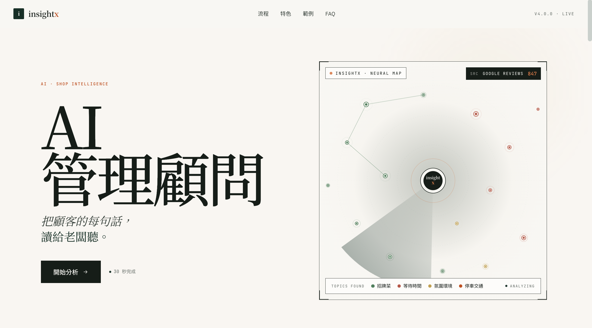
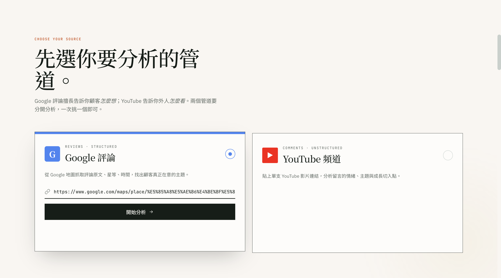
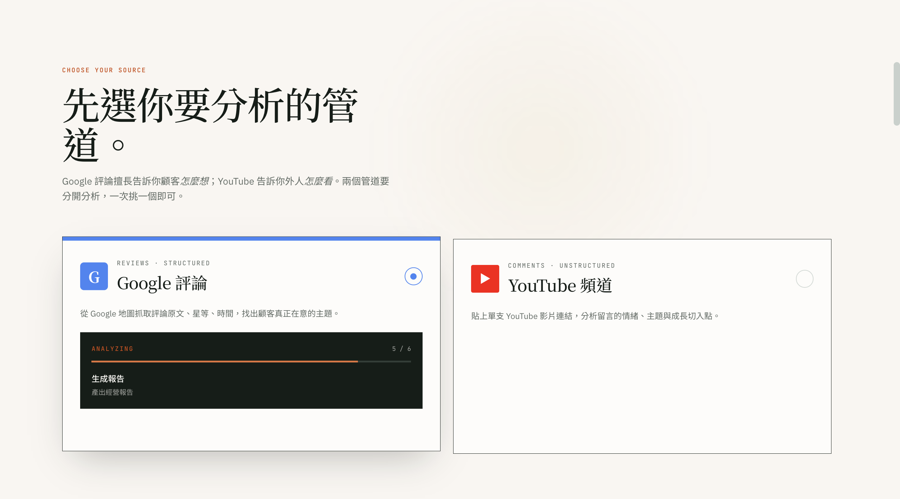
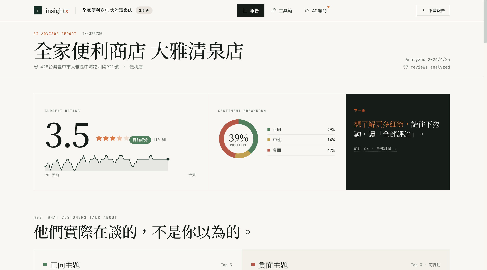
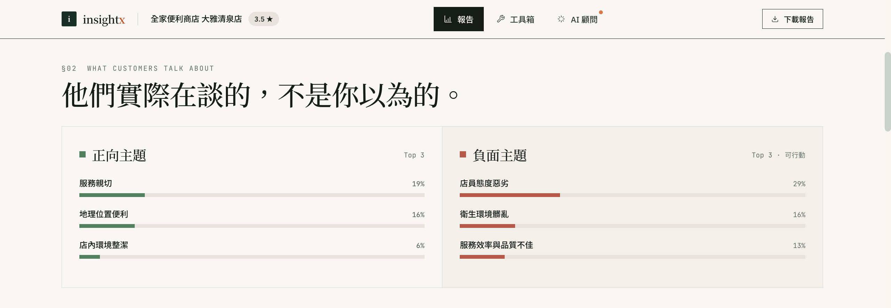
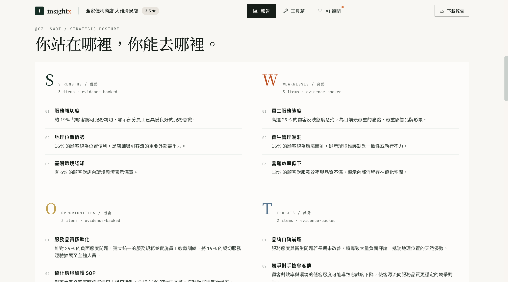
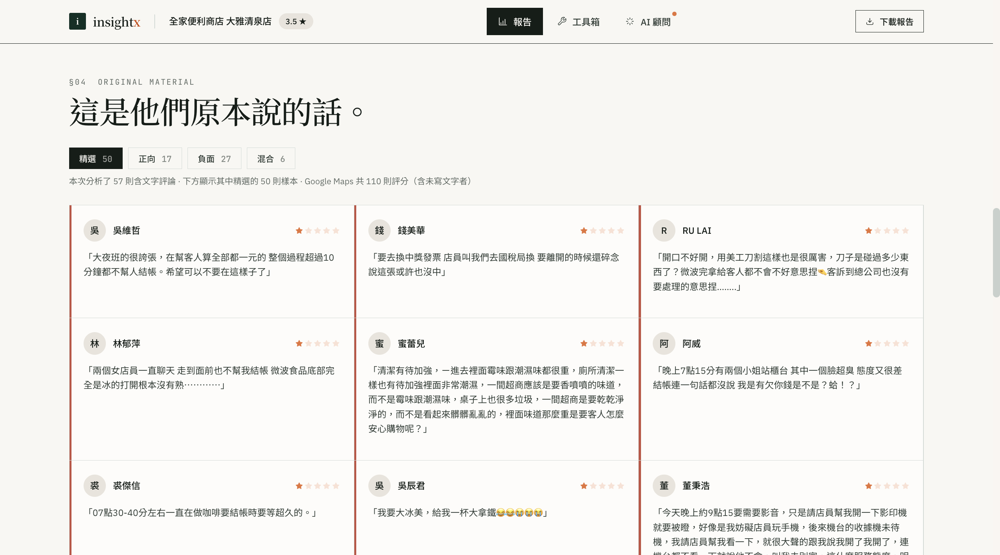
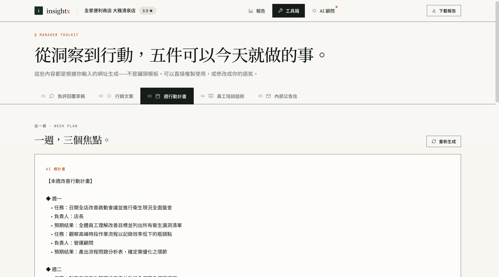
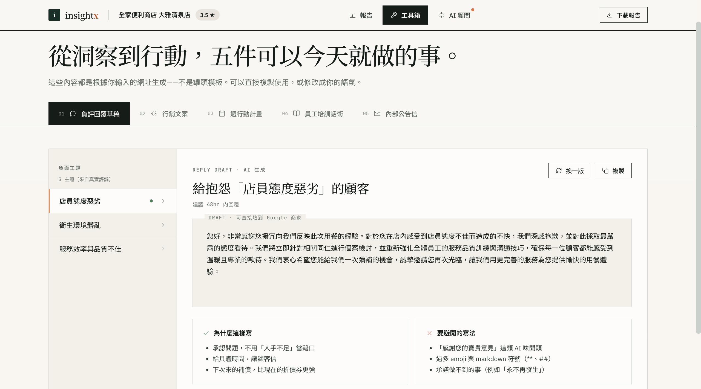
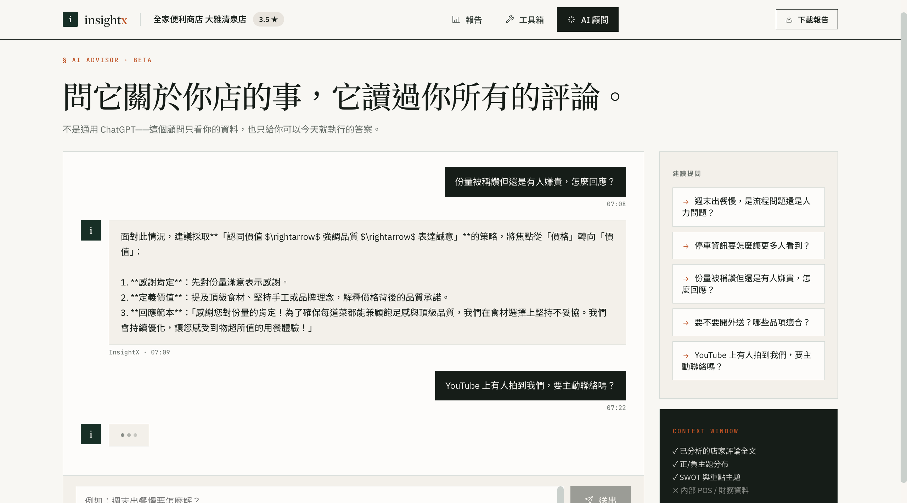

<div align="center">

# 🔍 InsightX

**Turn customer reviews — Google Maps stores or YouTube videos — into AI-powered business strategy**

[](https://Jordan711-insightx-demo.hf.space)
[](https://www.python.org/downloads/)
[](https://fastapi.tiangolo.com/)
[](https://www.sqlalchemy.org/)
[](https://turso.tech/)
[](https://huggingface.co/spaces/Jordan711/insightx_demo)
[](#changelog)
[](LICENSE)

**Language:** 🇺🇸 English | [🇹🇼 繁體中文](README_zh-TW.md)

</div>

---

## What is InsightX?

InsightX takes a **Google Maps store URL** or a **YouTube video URL**, scrapes the customer reviews / viewer comments via official APIs, and uses [Google Gemini](https://ai.google.dev/) to generate a full editorial-style report: sentiment analysis, theme breakdown, original-quote evidence, SWOT, reply drafts, weekly action plan, training scripts, internal email — and an interactive AI consultant.

**Two operating modes**, sharing the same nine downstream AI features:

| Mode | Source | Scraper | Best for |
|------|--------|---------|----------|
| 🏪 **Store Reviews** | Google Maps URL | [Serper API](https://serper.dev/) (`/maps` + `/reviews`) | Restaurants, retail, service shops |
| 🎬 **YouTube Comments** | YouTube video URL | [YouTube Data API v3](https://developers.google.com/youtube/v3) (+ `youtube-comment-downloader` fallback) | Creators, channel growth, content tuning |

**Zero browser, zero headless Chrome** — everything runs through HTTP APIs. No Playwright, no Selenium.

> 🚀 **Try the live demo**: <https://Jordan711-insightx-demo.hf.space> — runs on **Hugging Face Spaces Free** + **Turso (libsql)** at $0/month.

---

## What's new in v6.0.0-alpha (2026-05-19)

- **Full async → sync rewrite** of the FastAPI + SQLAlchemy + jobs stack so Turso/libsql (sync-only) can back the DB. See [`CHANGELOG.md`](CHANGELOG.md) for the migration rationale.
- **Codex img2 magazine-cover hero illustration** replacing the procedural neural-map (cream paper + risograph + Saul Bass × New Yorker references; multi-source convergence concept covers Maps + YouTube + future platforms).
- **Multi-model LLM fallback chain**: `gemma-4-26b-a4b-it` → `gemma-4-31b-it` → `gemini-2.5-flash` → `gemini-2.5-flash-lite`. Falls through on 5xx / quota errors without breaking the user-facing response.
- **HF Spaces deploy** — single-stage `python:3.10-slim` Dockerfile, port 7860, HEALTHCHECK, alembic-on-boot, non-root user. See [`docs/DEPLOY_HF.md`](docs/DEPLOY_HF.md) for the full Turso + HF setup.
- **v4 → v5 workspace bridge** — landing-page analyses can auto-persist into the `/workspace/` view when `IX_ENABLE_V4_WORKSPACE_PERSIST=1` (self-hosted only; off by default for multi-tenant safety).

8 rounds of Codex peer review across 3 phases (sync refactor, deploy, pre-freeze) reached APPROVE consensus before tagging. See [`HANDOFF.md`](HANDOFF.md) for the review history.

---

## See it in action

> Screenshots below are from the v4 UI shipped in `src/static/v2/`. The visual design carries over to v6 — only the hero illustration was replaced with a Codex img2-generated editorial image.

### 1 · Landing — pick your source

Magazine-grade hero with the new "universal listening post" illustration. One headline, one CTA, no clutter.

### 2 · Two platforms, one button

Pick **Google reviews** for stores or **YouTube comments** for video creators. The two pipelines stay separate — pick one and go.

### 3 · Real-time analysis

Server-Sent Events stream actual progress (`ANALYZING 5/6 · 生成報告`) — not a fake loading spinner. You see exactly which step the backend is on.

### 4 · Dashboard hero — one glance, full picture

Store name, rating with a 90-day trend sparkline, sentiment breakdown (positive / neutral / negative %), and a one-line "next step" pointer. Address + category for stores, video title + view count for YouTube.

### 5 · §02 What customers are really talking about

Top 3 positive vs. top 3 negative themes with real percentages from your reviews. No fake demo numbers — if Gemini didn't extract a theme, the slot stays empty rather than getting padded with mock data.

### 6 · §03 SWOT — strategic posture, evidence-backed

Strengths / Weaknesses / Opportunities / Threats, every bullet tagged `evidence-backed` and citing the % of reviews that triggered it. Not generic consultant boilerplate.

### 7 · §04 Original material — never lose the source

Up to 50 raw reviews with star ratings (or `♥ N` likes for YouTube), filtered by sentiment. Caption is honest about how many reviews were analyzed vs. displayed.

### 8 · §07 Toolbox — actionable, this week

The toolbox bundles 5 LLM-powered generators: review-reply drafts, marketing copy, **weekly action plan** (shown), staff training scripts, and internal team emails.

### 9 · §07 Reply drafts — per-complaint, never generic

Pick any negative theme on the left, get a complete reply draft on the right with a built-in self-critique panel.

### 10 · §AI Advisor — chat with a consultant who read everything

Ask anything about your store. The advisor only has your data in context — not generic ChatGPT — and surfaces follow-up questions on the right.

---

## Quick Start

### Option A · Live demo (recommended for trying it out)

<https://Jordan711-insightx-demo.hf.space> — no install, no signup. Paste a Google Maps URL into the "Google 評論" card and hit 開始分析.

### Option B · Local development

```bash
# Clone
git clone https://github.com/GKS711/InsightX.git
cd InsightX

# Env
cp .env.example .env
# Edit .env: GEMINI_API_KEY, SERPER_API_KEY, optionally YOUTUBE_API_KEY
# Leave DATABASE_URL unset for local SQLite (defaults to sqlite:///./insightx.db)

# Python
python -m venv .venv && source .venv/bin/activate
pip install -r requirements.txt

# DB schema
alembic upgrade head

# Run
uvicorn src.main:app --host 0.0.0.0 --port 8000 --reload
```

Open <http://localhost:8000>. Frontend is in `src/static/v2/` (Babel-standalone React, no build step). Workspace at `/workspace/`. API docs at `/docs`.

### Option C · Self-host on Hugging Face Spaces + Turso

Step-by-step guide: **[`docs/DEPLOY_HF.md`](docs/DEPLOY_HF.md)**. Highlights:

1. `turso db create insightx-demo --location nrt` (Tokyo)
2. Create HF Space (Docker SDK, CPU basic free)
3. Set 5 secrets (`DATABASE_URL`, `TURSO_AUTH_TOKEN`, `GEMINI_API_KEY`, `SERPER_API_KEY`, optional `YOUTUBE_API_KEY`)
4. `git clone https://huggingface.co/spaces/<user>/<space>`, `cp` over the source, `git push`
5. First build ~3min; subsequent rebuilds ~30s

Total cost: **$0/month** while you stay inside Gemini's free tier (1500 req/day) and Serper's free credits.

---

## What you get

After analysis, the dashboard renders an editorial-style report (think *The Economist* on a Sunday):

| Section | What it shows |
|---------|---------------|
| §01 Hero | Store / video name, address (or category), rating / like-count, sentiment donut |
| §02 Themes | Top positive & negative themes with quotes |
| §03 SWOT | Strategic posture (Strengths / Weaknesses / Opportunities / Threats) |
| §04 Original Material | Up to 50 raw reviews / comments with sentiment color-coding (or `♥ N` likes for YouTube) |
| §05 Weekly Action Plan | Concrete 7-day to-do list per persona (store owner / creator) |
| §06 Marketing | IG/FB-style copy aligned with your strengths |
| §07 Tools | Per-topic reply drafts, root-cause deep-dives, training scripts, internal staff emails |
| §08 AI Consultant | Chat with an AI advisor that knows your data |
| `/workspace/` | Optional persistent multi-store workspace (v5/v6 — requires Turso DB + bridge env flag) |

---

## How it works

```
   Google Maps URL  ─────┐
                         ├─▶ detect platform ─▶ Scraper ─▶ Gemini analyze ─▶ SSE stream ─▶ Dashboard
   YouTube video URL ────┘                          │                            │
                                                    │                            │
                                      ┌─────────────┴──────────────┐             │
                                      │ Serper /maps + /reviews    │             ▼
                                      │ YouTube Data API v3        │   IX_ENABLE_V4_WORKSPACE_PERSIST=1
                                      │  (+ library fallback)      │   ─▶ Turso persist + /workspace/
                                      └────────────────────────────┘

   Once "ready", 9 downstream LLM endpoints fire on-demand (SWOT, reply, marketing,
   weekly-plan, root-cause, training-script, internal-email, chat).
```

**v6 stack**: FastAPI (sync) + SQLAlchemy 2.0 (sync) + alembic + `sqlalchemy-libsql` + threading.Thread workers + Babel-standalone React. Zero-browser scraping, multi-model LLM fallback chain. Full architecture diagram in [`HANDOFF.md`](HANDOFF.md).

---

## API Reference

All endpoints are listed at `<your-host>/docs` (Swagger UI). Two API surfaces:

### v4 (stateless analysis — used by the landing page)

| Method | Endpoint | Description |
|--------|----------|-------------|
| `GET` | `/api/meta` | App metadata (version, available platforms, feature flags) |
| `GET` | `/api/v4/analyze-stream?url=...` | **Recommended.** Structured SSE with `progress` / `result` / `failed` events |
| `POST` | `/api/analyze` | Non-SSE fallback for the main analyze flow |
| `POST` | `/api/swot`, `/api/reply`, `/api/analyze-issue`, `/api/marketing`, `/api/weekly-plan`, `/api/training-script`, `/api/internal-email`, `/api/chat` | 8 platform-aware LLM feature endpoints |

### v5/v6 (persistent workspace — used by `/workspace/`)

| Method | Endpoint | Description |
|--------|----------|-------------|
| `POST` `GET` | `/api/v5/workspaces` | Create / list user workspaces |
| `POST` `GET` `DELETE` | `/api/v5/stores`, `/api/v5/stores/{id}` | Per-store CRUD with cascade-delete + 409 race guard |
| `POST` | `/api/v5/stores/{id}/scrape`, `/api/v5/stores/{id}/analyze` | Trigger background scrape / analyze jobs |
| `GET` | `/api/v5/jobs/{id}/stream`, `/api/v5/runs/{id}/stream` | SSE progress streams (heartbeat-driven) |
| `POST` `GET` `GET` | `/api/v5/stores/{id}/reports`, `/api/v5/reports/{id}`, `/api/v5/reports/{id}/download` | PDF / DOCX report generation + lazy regenerate on cold restart |

---

## Architecture (the files you'll touch)

```
InsightX/
├── src/
│   ├── main.py                  # FastAPI entry; mounts /, /workspace/, /legacy
│   ├── db.py                    # sync create_engine + Turso URL normalize
│   ├── models.py                # 9-table v5 ORM schema (passive_deletes=True on cascades)
│   ├── schemas.py               # Pydantic request/response shapes
│   ├── jobs.py                  # threading.Thread bg workers + progress_stream SSE generator
│   ├── api/
│   │   ├── routes.py            # v4 stateless endpoints + v4→v5 workspace bridge
│   │   └── v5.py                # v5 persistent endpoints
│   ├── services/
│   │   ├── scraper_service.py   # Serper /maps + /reviews + URL dispatcher
│   │   ├── youtube_scraper.py   # YouTube Data API v3 + library fallback
│   │   ├── llm_service.py       # 9 Gemini calls + MODEL_CHAIN multi-model fallback
│   │   ├── reports.py           # PDF / DOCX generation
│   │   └── canonicalizer.py     # yt_role canonicalize + metadata wrapper
│   └── static/
│       ├── v2/                  # ★ v4/v6 main UI — React 18 + Babel single-file
│       │   ├── index.html       # ~3500-line single-file SPA
│       │   ├── assets/hero-listening.png  # Codex img2 hero (LFS-tracked)
│       │   ├── bootstrap.js     # ES module → window.IX bridge
│       │   ├── core/            # adapters / api / async / ids
│       │   ├── hooks/           # useAppReducer / useAnalyzeStream / useLocalStorage
│       │   └── workspace/       # Sidecar workspace UI (mounted at /workspace/)
│       └── index.html           # Legacy v3 HTML (mounted at /legacy)
├── alembic/                     # DB migrations (sync; Turso-aware via src.db._engine_kwargs)
├── docs/
│   ├── DEPLOY_HF.md             # ★ Step-by-step HF Spaces + Turso deployment
│   ├── v4-api-contract.md       # API contract spec
│   ├── v4-sse-events.md         # SSE event types
│   ├── v4-view-model.md         # Frontend view-model spec
│   ├── v4-smoke-test.md         # Manual E2E checklist
│   └── archive/                 # Historical: v3 migration plan, Codex review notes, V5_NOTES
├── deploy/hf-space-README.md    # HF Space repo README template with YAML frontmatter
├── outputs/test_reducer.mjs     # 48-case reducer + adapter regression test
├── validate_jsx.cjs             # @babel/parser JSX validator
├── pyproject.toml + requirements.txt   # Python deps (libsql pair pinned)
├── Dockerfile                   # Single-stage py3.10-slim for HF Spaces
└── HANDOFF.md                   # ★ Architecture deep-dive for the next maintainer
```

### Locked invariants

Rules codified across backend + frontend that any future change must preserve:

1. **Frontend `timeoutMs` ≥ Backend `total_timeout_s` + 5s buffer** — otherwise frontend abort leaves backend burning quota
2. **Service layer raises on failure** (no silent fallback dict) — mock fallback only at route layer behind `_fallback:true` flag
3. **Retry by exception type**, never string-match — `genai_errors.ServerError` / `429` / `httpx.NetworkError`
4. **Prompt skeletons match the `<pre>` renderer** — no markdown; use `【】 ◆　▸` plain-text structure
5. **Backend uncapped scrape, frontend display cap** — `MAX_REVIEWS_DISPLAY = 50` with honest "本次分析了 N · 顯示 50 則樣本" caption

Full rationale + the historical bug fixes that locked these: [`HANDOFF.md`](HANDOFF.md).

---

## Two platforms — schema notes

YouTube borrows the store-mode JSON schema (so the 9 downstream LLM endpoints stay platform-agnostic), so a few fields **mean different things** depending on `platform`:

| Field | Google mode | YouTube mode |
|-------|-------------|--------------|
| `raw.store_name` | Store name | Video title |
| `raw.review_count` | Reviews scraped (with text) | Comments scraped |
| `raw.rating` | 1–5 star rating | Video like count |
| `raw.rating_count` | Total reviews on Google Maps | View count |
| `raw.address` / `category` | Real values | Empty / "YouTube 影片" |
| `raw.reviews_structured[].rating` | 1–5 star | Comment like count |

The frontend `HeroStat` / `Masthead` / `TopNav` / `ReviewCard` are **platform-aware** and render the correct labels (e.g. `7,381 讚` instead of `7,381 ★`) so users never see a like count masquerading as a five-star rating.

---

## Environment Variables

| Variable | Required | Notes |
|----------|----------|-------|
| `GEMINI_API_KEY` | **Yes** | [aistudio.google.com/app/apikey](https://aistudio.google.com/app/apikey) — drives all LLM calls |
| `SERPER_API_KEY` | Store mode | [serper.dev](https://serper.dev/) — Google Maps `/maps` + `/reviews` |
| `YOUTUBE_API_KEY` | YouTube mode (recommended) | [console.cloud.google.com](https://console.cloud.google.com) → enable **YouTube Data API v3**. Free quota 10,000 units/day. Without it, the library fallback runs (no key, no quota cap, but no `like_count` / `view_count`). |
| `YOUTUBE_FALLBACK_MODE` | No | `auto` (default) / `force-ytdlp` (force library) / `off` (disable fallback) |
| `DATABASE_URL` | Production | Turso libsql URL (`libsql://...`) for production; default `sqlite:///./insightx.db` for local |
| `TURSO_AUTH_TOKEN` | Production w/ Turso | JWT from `turso db tokens create <db>` |
| `IX_ENABLE_V4_WORKSPACE_PERSIST` | No | Set `=1` for self-hosted single-user to auto-persist landing analyses into `/workspace/`. **Leave unset on public/multi-tenant demos** until cookie session scoping ships in v6.1. |
| `ENVIRONMENT` | No | `development` or `production` |

---

## Testing & Validation

Three commands cover all automated checks (no API keys needed):

```bash
# Frontend JSX integrity
node validate_jsx.cjs

# Reducer + adapter regression (48 cases)
node outputs/test_reducer.mjs

# Python syntax
python3 -m py_compile src/services/*.py src/api/*.py src/main.py
```

Smoke test the live deploy:

```bash
SPACE=https://Jordan711-insightx-demo.hf.space
curl -s $SPACE/api/meta | jq .appVersion       # → "6.0.0-alpha"
```

Manual E2E (requires real API keys + uvicorn): see [`docs/v4-smoke-test.md`](docs/v4-smoke-test.md).

---

## Development

```bash
# Backend with hot reload
python -m uvicorn src.main:app --reload --port 8000
```

The v4 UI is **single-file** + Babel standalone, so most front-end edits to `src/static/v2/index.html` go live with just a browser hard-reload. No webpack / Vite rebuild needed unless you touch `core/` or `hooks/` ES modules.

---

## Changelog

See [`CHANGELOG.md`](CHANGELOG.md) for the full version history. Highlights:

- **v6.0.0-alpha (2026-05-19)** — Full sync rewrite for Turso/libsql compatibility. Multi-model LLM fallback chain. Codex img2 magazine-cover hero. HF Spaces single-stage Dockerfile. v4→v5 workspace bridge (env-gated). 8 rounds of Codex peer review.
- **v5.0.0 (2026-05-19)** — Persistent multi-store workspace. 9-table v5 schema. async SQLAlchemy 2.0 ORM. Store deletion with cascade integrity. Codex Round 3 race-window fixes.
- **v4.0.0 (2026-04-23)** — Single-file React 18 + `@babel/standalone` SPA. Structured `/api/v4/analyze-stream` SSE. 9 platform-aware LLM endpoints. 48-case reducer regression test.
- **v3.0.0** — Codebase consolidated to Google Maps + YouTube. Shopee mode formally abandoned.
- **v2.0.0** — YouTube channel mode with dual-path scraper.
- **v1.x** — Initial Google Maps analyzer.

---

## License

MIT — see [LICENSE](LICENSE).

---

## Acknowledgments

[Google Gemini](https://ai.google.dev/) · [Serper API](https://serper.dev/) · [YouTube Data API v3](https://developers.google.com/youtube/v3) · [youtube-comment-downloader](https://pypi.org/project/youtube-comment-downloader/) · [FastAPI](https://fastapi.tiangolo.com/) · [SQLAlchemy](https://www.sqlalchemy.org/) · [Turso](https://turso.tech/) · [Hugging Face Spaces](https://huggingface.co/docs/hub/spaces) · [React](https://react.dev/) · [@babel/standalone](https://babeljs.io/docs/babel-standalone)
