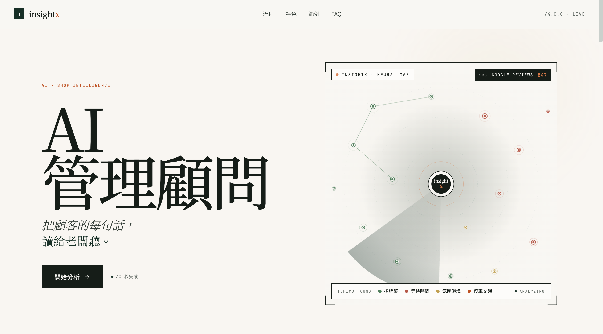
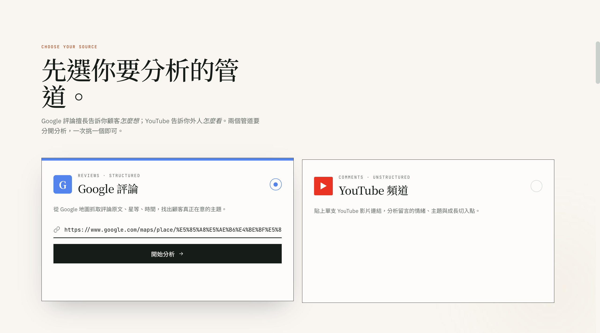
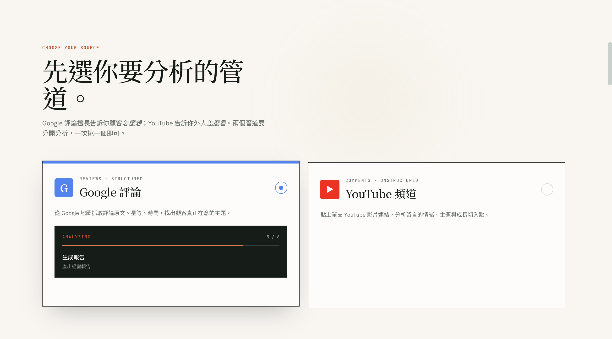
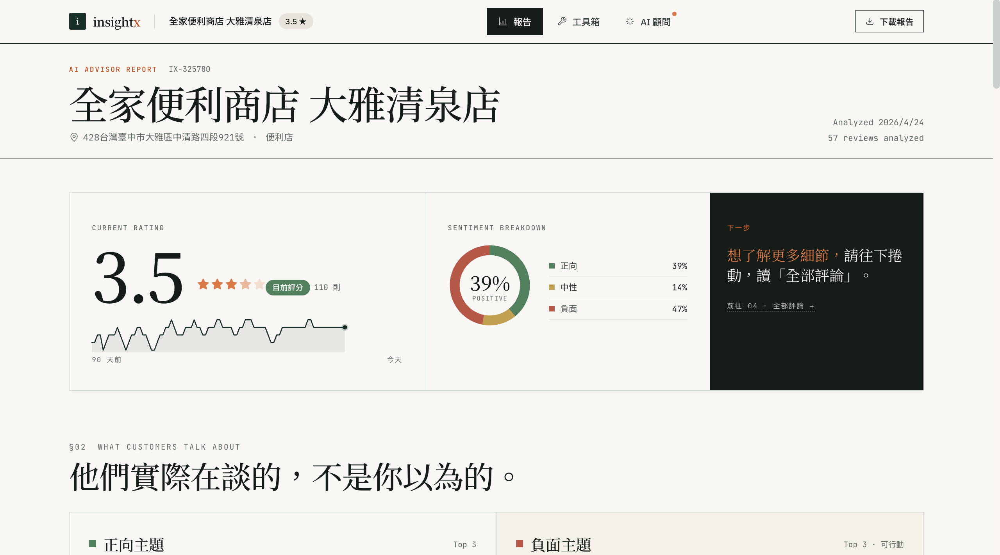
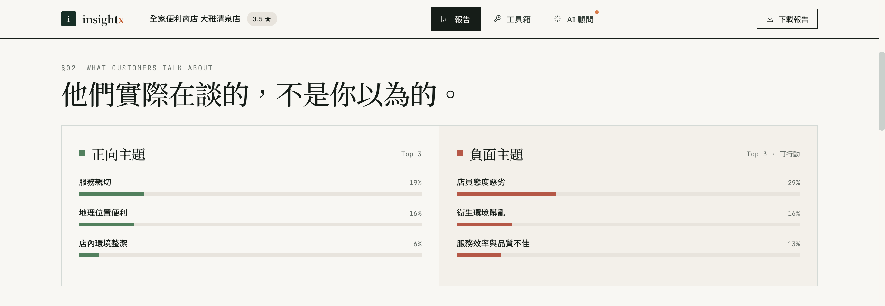
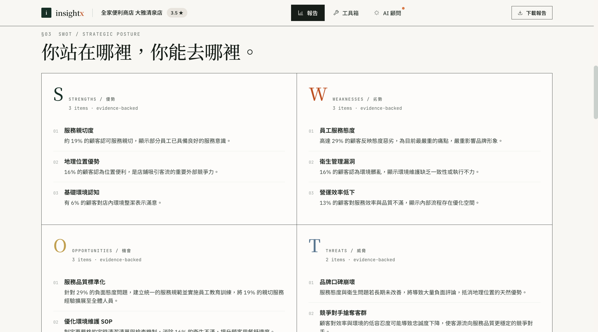
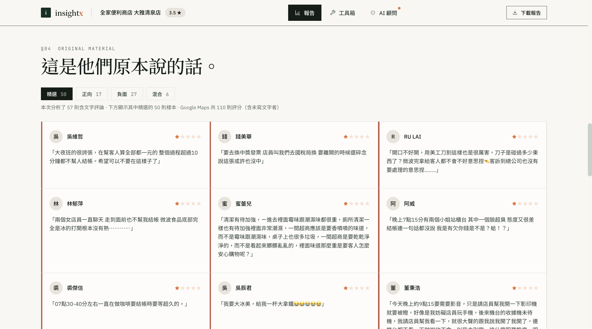
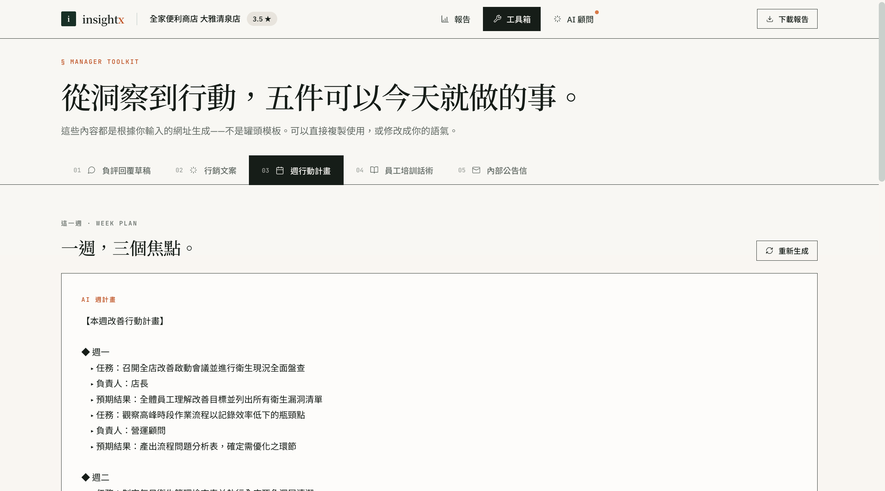
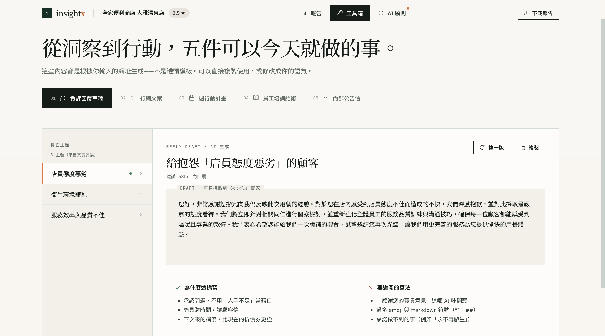
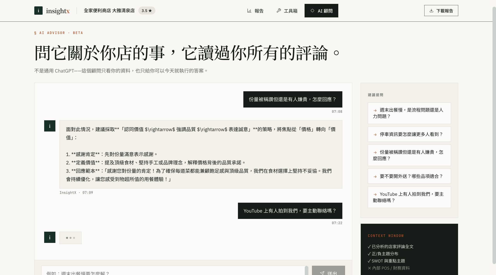

<div align="center">

# 🔍 InsightX

**把顧客評論——不論是 Google Maps 店家，還是 YouTube 影片——變成 AI 驅動的商業策略**

[](https://www.python.org/downloads/)
[](https://fastapi.tiangolo.com/)
[](https://reactjs.org/)
[](#更新紀錄)
[](LICENSE)

**語言：** [🇺🇸 English](README.md) | 🇹🇼 繁體中文

</div>

---

## 這是什麼？

InsightX 接受**Google Maps 店家網址**或**YouTube 影片網址**，透過官方 API 抓取顧客評論／觀眾留言，然後用 [Google Gemini](https://ai.google.dev/) 生成一份完整的雜誌風報告：情感分析、主題拆解、原文佐證、SWOT、回覆草稿、週行動計畫、培訓劇本、內部信，還有可即時對話的 AI 顧問。

**雙模式運作**，共用同一組 9 個下游 AI 功能：

| 模式 | 來源 | 爬蟲 | 適用對象 |
|------|------|------|---------|
| 🏪 **店家評論** | Google Maps 網址 | [Serper API](https://serper.dev/)（`/maps` + `/reviews`） | 餐廳、零售、服務業 |
| 🎬 **YouTube 留言** | YouTube 影片網址 | [YouTube Data API v3](https://developers.google.com/youtube/v3)（+ `youtube-comment-downloader` 備用） | 創作者、頻道成長、內容調校 |

**零瀏覽器、零 headless Chrome** ⸺ 全程 HTTP API。沒有 Playwright，沒有 Selenium。

---

## 實際樣子長這樣

### 1 · 落地頁 — 選你要分析的來源

雜誌風 hero，配上正在偵測主題的神經網絡動畫。一個標題、一個 CTA，沒有多餘介面。

### 2 · 兩種來源、一鍵分析

店家就選 **Google 評論**，創作者就選 **YouTube 留言**。兩條 pipeline 分開跑，挑一個按下去就分析。

### 3 · 即時分析進度

Server-Sent Events 串流真實進度（`ANALYZING 5/6 · 生成報告`）⸺ 不是假的 loading 動畫。你看到的就是後端目前跑到哪一步。

### 4 · Dashboard Hero — 一眼看完核心指標

店名、評分含 90 天趨勢線、情感分布（正向 / 中性 / 負面 %）、加上一句「下一步看哪裡」導引。店家顯示地址 + 類別，YouTube 顯示影片標題 + 觀看數。

### 5 · §02 顧客真正在談的事

Top 3 正向 vs. Top 3 負面主題，數字全部來自你真實的評論。沒有假的 demo 數字 ⸺ 如果 Gemini 沒抽出某個主題，那格就空著，絕不用罐頭數字填充。

### 6 · §03 SWOT — 策略定位，每條都有證據

優勢／劣勢／機會／威脅，每條都標 `evidence-backed`，引用觸發它的評論 %。不是顧問樣板那種空話。

### 7 · §04 原文 — 永遠看得見來源

最多 50 則原始評論，附星等（YouTube 模式顯示 `♥ N` 讚數），按情感篩選。Caption 寫得誠實：「本次分析了 57 則含文字評論 · 下方顯示其中精選的 50 則樣本 · Google Maps 共 110 則評分（含未寫文字者）」⸺ 不騙你說這 50 則就是全部。

### 8 · §07 工具箱 — 這週就能執行

工具箱包 5 個 LLM 驅動的產生器：負評回覆草稿、行銷文案、**週行動計畫**（圖示）、員工培訓話術、內部公告信。每一個都根據你真實的評論資料生成。

### 9 · §07 負評回覆草稿 — 針對個別痛點，不講罐頭話

左側挑任一負面主題（`店員態度惡劣` / `衛生環境髒亂` / `服務效率與品質不佳`⋯），右側即出完整回覆草稿，附上「為什麼這樣寫」/「要避開的寫法」自我審查面板。一鍵 換一版 / 複製。

### 10 · §AI 顧問 — 和讀過所有資料的顧問對話

問它任何關於你店的事。AI 顧問的 context 只有你的資料 ⸺ 不是通用 ChatGPT，而且右側會主動拋建議提問（份量被稱讚但有人嫌貴、停車資訊怎麼讓更多人看到 等）。

---

## 快速開始（3 步驟）

### 1. Clone & 設定

```bash
git clone https://github.com/GKS711/InsightX.git
cd InsightX
cp .env.example .env
```

編輯 `.env`，最少需要：

```
GEMINI_API_KEY=your_key_here          # https://aistudio.google.com/app/apikey
SERPER_API_KEY=your_key_here          # 店家模式必填（https://serper.dev）
YOUTUBE_API_KEY=your_key_here         # YouTube 模式建議填（https://console.cloud.google.com → YouTube Data API v3）
```

如果 `YOUTUBE_API_KEY` 沒設，YouTube 模式會自動 fallback 到免費 library（無 key、無配額限制，但拿不到 like_count / view_count）。

### 2. 安裝依賴

```bash
# Python（擇一）
pip install -r requirements.txt
# 或：uv sync

# 前端（如果你要重新打包資產才需要 — 預編譯成品已附在 src/static/v2/）
npm install && npm run build
```

### 3. 啟動

```bash
python -m uvicorn src.main:app --host 0.0.0.0 --port 8000
```

打開 **http://localhost:8000**，貼上 Google Maps 或 YouTube 網址，按「**開始分析**」⸺ 完成。

> v4 React UI 掛在 `/`。先前的 v3 HTML 保留在 `/legacy` 作為備用（唯讀）。

---

## 你會拿到什麼

分析完成後，dashboard 會渲染一份雜誌風報告（想像《經濟學人》週日版）：

| 區塊 | 內容 |
|------|------|
| §01 Hero | 店名／影片標題、地址（或類別）、評分／影片讚數、情感比例環 |
| §02 主題 | 正向／負向 Top 主題＋顧客原話引用 |
| §03 SWOT | 策略定位（優勢／劣勢／機會／威脅） |
| §04 原文 | 最多 50 則原始評論／留言，附情感色標（YouTube 模式顯示「♥ N」讚數） |
| §05 週行動計畫 | 7 天具體 to-do（按 persona：店家老闆／頻道創作者） |
| §06 行銷文案 | IG／FB 風文案，對齊你的優勢 |
| §07 工具 | 個別主題的回覆草稿、根源分析、培訓劇本、內部信 |
| §08 AI 顧問 | 跟掌握你資料的 AI 顧問即時對話 |

**附贈：經理人決策模擬遊戲** ⸺ 互動式遊戲，10 個真實情境訓練管理判斷力（獨立 React mini-app）。

---

## 運作方式

```
   Google Maps 網址 ─────┐
                         ├─▶ 自動偵測平台 ─▶ 爬蟲 ─▶ Gemini 分析 ─▶ SSE 串流 ─▶ Dashboard
   YouTube 影片網址 ────┘                       │
                                                │
                                      ┌─────────┴─────────┐
                                      │ Serper /reviews   │（Google Maps）
                                      │ YouTube Data v3   │（含 library fallback）
                                      └───────────────────┘

   分析「ready」後，9 個下游 LLM endpoint 可按需呼叫
   （SWOT、回覆、行銷、週計畫、根源、培訓、內部信、對話）
```

整條管線**完全零瀏覽器** ⸺ 沒 Chrome、沒 Playwright，純 HTTP。

---

## API 參考

完整列表在 `http://localhost:8000/docs`（Swagger UI）。每個 endpoint 都接受可選的 `platform: "google" | "youtube"` 欄位，預設 `"google"`。

### 入口 & 主分析

| 方法 | Endpoint | 說明 |
|------|----------|------|
| `GET` | `/api/meta` | App 元資料（版本、可用平台、feature flags） |
| `GET` | `/api/v4/analyze-stream?url=...` | **建議使用。** 結構化 SSE 串流，含 `progress` / `result` / `failed` 三種 event |
| `GET` | `/api/analyze-stream?url=...` | 舊 SSE（向後相容保留） |
| `POST` | `/api/analyze` | 非 SSE fallback（同樣跑主分析流程） |

### 9 個 LLM Feature Endpoints

全部 POST、全部 platform-aware、全部回 JSON：

| Endpoint | 產出 |
|----------|------|
| `/api/swot` | SWOT 四象限分析 |
| `/api/reply` | 對特定負評／留言的回覆草稿 |
| `/api/analyze-issue` | 根源問題深入分析 |
| `/api/marketing` | 社群媒體文案 |
| `/api/weekly-plan` | 7 天行動計畫 |
| `/api/training-script` | 員工／剪輯師培訓劇本 |
| `/api/internal-email` | 團隊內部信 |
| `/api/chat` | AI 顧問對話 |
| `/api/debug-scrape` | 純爬蟲輸出（無 LLM）⸺ 除錯用 |

---

## 架構

```
InsightX/
├── src/
│   ├── main.py                  # FastAPI 入口；掛 / 主介面、/legacy 舊版、靜態檔
│   ├── api/routes.py            # 全部 HTTP + SSE endpoint
│   ├── services/
│   │   ├── scraper_service.py   # Serper /maps + /reviews + URL dispatcher
│   │   ├── youtube_scraper.py   # YouTube Data API v3 + downloader fallback
│   │   ├── llm_service.py       # 9 個 Gemini 呼叫（platform-aware persona）
│   │   └── canonicalizer.py     # yt_role canonicalize + metadata 包裝
│   ├── config/
│   │   ├── prompts.py           # AI prompt 模板
│   │   └── mock_responses.py    # demo fallback 資料（僅 /legacy 用）
│   └── static/
│       ├── v2/                  # ★ v4.0.0 主介面（現行）⸺ React 18 + Babel 單檔 SPA
│       │   ├── index.html       # 3550 行 single-file SPA
│       │   ├── bootstrap.js     # ES module → window.IX bridge
│       │   ├── core/            # adapters / api / async / ids
│       │   └── hooks/           # useAppReducer / useAnalyzeStream / useLocalStorage
│       └── index.html           # 舊 v3 HTML（掛在 /legacy）
├── docs/
│   ├── v4-api-contract.md       # API 契約規格
│   ├── v4-sse-events.md         # SSE event 規格
│   ├── v4-view-model.md         # 前端 view-model 規格
│   └── v4-smoke-test.md         # 手動 E2E checklist
├── outputs/test_reducer.mjs     # 48 case reducer + adapter 回歸測試
├── validate_jsx.cjs             # @babel/parser JSX 驗證
├── pyproject.toml               # Python deps（uv）
├── requirements.txt             # Python deps（pip，給 Docker 用）
├── package.json                 # 前端 deps
├── Dockerfile / compose.yaml    # Docker 部署
└── .env.example                 # 環境變數範本
```

### 前端（v4）

v4 UI 是 `src/static/v2/index.html` 的**單檔 React 18 SPA**，用 `@babel/standalone` 在瀏覽器內即時編譯 — **不需要 build step** 就能上線。核心邏輯放 `core/` + `hooks/` 的 ES module，由 `bootstrap.js` 橋接到 `window.IX`。

### 鎖定的 4 條 invariant

跨 backend + frontend 三層強制的規則，任何後續修改都必須保留。精簡版：

1. **Frontend `timeoutMs` ≥ Backend `total_timeout_s` + 5s buffer**
2. **Service 層失敗一律 raise**（不回 fallback dict 造成 silent degradation）
3. **Retry 走 exception type**，不靠字串比對
4. **Prompt 骨架對齊 `<pre>` renderer**（無 markdown，用 `【】 ◆　▸` 純文字結構）

完整理由 + 鎖定這四條的歷史 bug：[`HANDOFF.md`](HANDOFF.md)。API 契約 / SSE event / view-model 細節：[`docs/v4-*.md`](docs/)。

---

## 雙平台 — schema 借用注意

YouTube 模式為了讓 9 個下游 LLM endpoint 維持 platform-agnostic，**借用了店家模式的 JSON schema**。所以同一個欄位在兩個平台的**意義不同**：

| 欄位 | Google 模式 | YouTube 模式 |
|------|-------------|--------------|
| `raw.store_name` | 店名 | 影片標題 |
| `raw.review_count` | 抓到的有文字評論數 | 抓到的留言數 |
| `raw.rating` | 1–5 星評分 | 影片讚數 |
| `raw.rating_count` | Google Maps 顯示的總則數 | 觀看數 |
| `raw.address` / `category` | 真實值 | 空 / 「YouTube 影片」 |
| `raw.reviews_structured[].rating` | 1–5 星 | 留言讚數 |

前端的 `HeroStat` / `Masthead` / `TopNav` / `ReviewCard` 都是 **platform-aware**，會根據 `vm.platform` 渲染對應 label（例如 `7,381 讚` 不會變成 `7,381 ★`），確保使用者不會把讚數誤看成五星評分。

---

## 環境變數

| 變數 | 必要 | 說明 |
|------|------|------|
| `GEMINI_API_KEY` | **必填** | [aistudio.google.com/app/apikey](https://aistudio.google.com/app/apikey) ⸺ 全部 10 個 LLM 呼叫共用 |
| `SERPER_API_KEY` | 店家模式必填 | [serper.dev](https://serper.dev/) ⸺ Google Maps `/maps` + `/reviews` |
| `YOUTUBE_API_KEY` | YouTube 模式建議填 | [console.cloud.google.com](https://console.cloud.google.com) → 啟用 **YouTube Data API v3** → 建立 API key。免費配額 10,000 units/day。沒設則走 library fallback（無 key 無配額，但拿不到 like_count / view_count） |
| `YOUTUBE_FALLBACK_MODE` | 否 | `auto`（預設）／`force-ytdlp`（強制 library）／`off`（關閉 fallback） |
| `ENVIRONMENT` | 否 | `development` 或 `production` |

---

## 測試與驗證

3 條指令涵蓋所有自動化檢查（不需 API key）：

```bash
# 前端 JSX 完整性
node validate_jsx.cjs

# Reducer + adapter 回歸
node outputs/test_reducer.mjs

# Python 語法
python3 -m py_compile src/services/*.py src/api/*.py src/main.py
```

手動 E2E（需要真 API key + uvicorn）：見 [`docs/v4-smoke-test.md`](docs/v4-smoke-test.md)。

---

## 開發

```bash
# 後端 hot reload
python -m uvicorn src.main:app --reload --port 8000

# （選用）前端 Vite HMR ⸺ 只在你要改 React component 檔時才需要
npm run dev
```

現行 v4 UI 是**單檔** + Babel standalone，所以大多數 `src/static/v2/index.html` 的前端改動，瀏覽器 hard reload 就生效。除非你動 `core/` 或 `hooks/` 的 ES module，否則不需要 webpack / Vite 重打包。

---

## Docker

```bash
cp .env.example .env
# 編輯 .env 加上你的 API keys
docker compose up -d
# → http://localhost:8080
```

---

## 更新紀錄

### v4.0.0（2026-04-23）

UI 全面遷移到 `src/static/v2/` 單檔 React 18 + `@babel/standalone` SPA。新增結構化 `/api/v4/analyze-stream` SSE endpoint、9 個 platform-aware LLM feature endpoints、含 `requestId` stale-discard 的 slice reducer、跨 backend+frontend 鎖定的 4 條 invariant、48 case reducer/adapter contract 回歸測試。舊 v3 HTML 保留在 `/legacy`。

### v3.0.0 ⸺ 模式精簡

codebase 整併為兩個運作模式（Google Maps + YouTube）。`package.json` / `pyproject.toml` 版本對齊。

### v2.0.0 ⸺ 加入 YouTube 頻道模式

雙路徑留言爬蟲：官方 YouTube Data API v3（有配額）+ `youtube-comment-downloader` library fallback（無 key 也能跑）。

### v1.x ⸺ Google Maps 評論分析初版

---

## License

MIT — 見 [LICENSE](LICENSE)。

---

## 致謝

[Google Gemini](https://ai.google.dev/) · [Serper API](https://serper.dev/) · [YouTube Data API v3](https://developers.google.com/youtube/v3) · [youtube-comment-downloader](https://pypi.org/project/youtube-comment-downloader/) · [FastAPI](https://fastapi.tiangolo.com/) · [React](https://react.dev/) · [@babel/standalone](https://babeljs.io/docs/babel-standalone)
