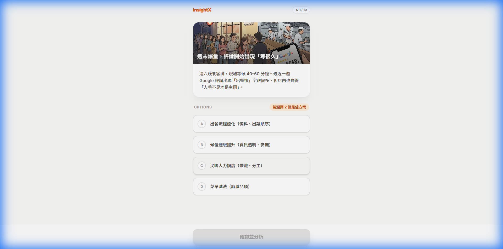

<div align="center">

# 🔍 InsightX

**把 Google Maps 評論變成經營策略 — AI 驅動**

[](https://www.python.org/downloads/)
[](https://fastapi.tiangolo.com/)
[](https://reactjs.org/)
[](LICENSE)

**語言：** [🇺🇸 English](README.md) | 🇹🇼 繁體中文

</div>

---

## InsightX 是什麼？

InsightX 讓你貼上 Google Maps 店家網址，自動透過 [Serper API](https://serper.dev/) 爬取所有顧客評論，再用 [Google Gemini](https://ai.google.dev/) 生成情緒分析、SWOT 報告、回覆範本、行銷文案、培訓劇本等實用產出。

不需要瀏覽器、不需要 Playwright — 全部透過 API 完成。


---

## 快速開始（3 步驟）

### 1. Clone & 設定環境

```bash
git clone https://github.com/yourusername/InsightX.git
cd InsightX
cp .env.example .env
```

編輯 `.env`，填入你的 **Gemini API Key**（Serper key 已預填，可直接使用）：

```
GEMINI_API_KEY=你的金鑰            # ← 到 https://aistudio.google.com/app/apikey 申請
SERPER_API_KEY=d270c73...          # ← 已內建體驗用 Key
```

### 2. 安裝依賴

```bash
# Python（擇一）
pip install -r requirements.txt           # pip
# 或：uv sync                             # uv（如果有安裝的話）

# 前端
npm install && npm run build
```

### 3. 啟動

```bash
python -m uvicorn src.main:app --host 0.0.0.0 --port 8000
```

開啟 **http://localhost:8000**，貼上 Google Maps 網址，開始分析。

---

## Docker（替代方式）

```bash
cp .env.example .env
# 編輯 .env，填入 GEMINI_API_KEY
docker compose up -d
# → http://localhost:8080
```

---

## 功能一覽

**核心分析** — 貼上 Google Maps 網址 → 自動分類正面/負面主題及比例

**經營者工具箱**（全部從你的評論數據生成）：

| 工具 | 功能 |
|------|------|
| SWOT 分析 | 優勢、劣勢、機會、威脅 |
| 回覆草稿 | 專業的負評回覆範本 |
| 行銷文案 | 根據優勢撰寫社群貼文 |
| 根源分析 | 深入挖掘反覆出現的客訴 |
| 週行動計畫 | 給團隊的具體改善步驟 |
| 培訓劇本 | 員工教育訓練素材 |
| 內部信 | 改善計畫的員工公告 |
| AI 顧問 | 針對分析結果的 AI 對話 |

**額外功能：店長決策模擬室** — 10 個真實經營情境的互動訓練遊戲。

<table>
  <tr>
    <td width="50%"></td>
    <td width="50%"></td>
  </tr>
</table>

---

## 運作原理

```
Google Maps 網址
      │
      ▼
┌─────────────────┐     ┌──────────────┐     ┌──────────────────┐
│  Serper API      │ ──▶ │  Gemini AI   │ ──▶ │  分析儀表板 +    │
│  (爬取評論       │     │  (情緒分析    │     │  經營者工具      │
│   含自動翻頁)    │     │   主題提取)   │     │                  │
└─────────────────┘     └──────────────┘     └──────────────────┘
```

零瀏覽器、零 Playwright、零 Selenium — 純 HTTP API 呼叫。

---

## API 端點

啟動後訪問 `http://localhost:8000/docs` 查看 Swagger UI。

| 方法 | 端點 | 說明 |
|------|------|------|
| `POST` | `/api/analyze` | 爬取 + 分析（主要端點） |
| `GET` | `/api/analyze-stream` | SSE 串流版本 |
| `POST` | `/api/swot` | SWOT 分析 |
| `POST` | `/api/reply` | 生成評論回覆 |
| `POST` | `/api/marketing` | 行銷文案 |
| `POST` | `/api/analyze-issue` | 根源問題分析 |
| `POST` | `/api/weekly-plan` | 週行動計畫 |
| `POST` | `/api/training-script` | 培訓劇本 |
| `POST` | `/api/internal-email` | 內部公告信 |
| `POST` | `/api/chat` | AI 顧問對話 |

---

## 專案結構

```
InsightX/
├── src/
│   ├── main.py                  # FastAPI 入口
│   ├── api/routes.py            # 所有 API 端點
│   ├── services/
│   │   ├── scraper_service.py   # Serper API 爬蟲（零瀏覽器）
│   │   └── llm_service.py       # Gemini AI 整合
│   ├── config/
│   │   ├── prompts.py           # AI prompt 模板
│   │   └── mock_responses.py    # Demo 備用資料
│   └── static/                  # React 前端
├── dev/                         # 測試與除錯腳本（選用）
├── public/pictures/             # 遊戲素材
├── docs/screenshots/            # README 截圖
├── requirements.txt             # Python 依賴（pip）
├── pyproject.toml               # Python 依賴（uv）
├── package.json                 # Node.js 依賴
├── Dockerfile / compose.yaml    # Docker 部署
└── .env.example                 # 環境變數範本
```

---

## 開發模式

```bash
# 後端（終端機 1，支援熱重載）
python -m uvicorn src.main:app --reload --port 8000

# 前端（終端機 2，支援 HMR）
npm run dev
# → http://localhost:5173（API 自動代理到 port 8000）
```

**診斷工具：**
```bash
python dev/test_backend.py    # 檢查 API Key 和連線狀態
```

---

## 環境變數

| 變數 | 必填 | 說明 |
|------|------|------|
| `GEMINI_API_KEY` | **是** | [到這裡申請](https://aistudio.google.com/app/apikey) |
| `SERPER_API_KEY` | **是** | `.env.example` 已內建體驗用 Key。正式使用請[申請自己的](https://serper.dev/) |
| `ENVIRONMENT` | 否 | `development` 或 `production` |

---

## 授權

MIT — 詳見 [LICENSE](LICENSE)。

---

## 致謝

[Google Gemini](https://ai.google.dev/) · [Serper API](https://serper.dev/) · [FastAPI](https://fastapi.tiangolo.com/) · [React](https://react.dev/) · [Vite](https://vitejs.dev/) · [Tailwind CSS](https://tailwindcss.com/)

</div>

